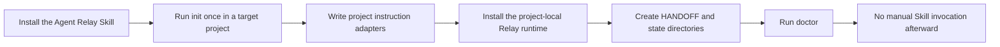
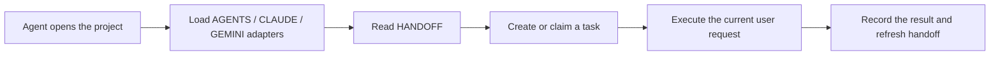
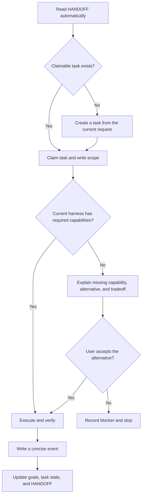
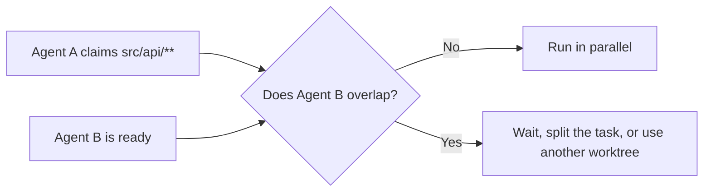

<p align="center">
  <a href="./README.md">简体中文</a> · <strong>English</strong>
</p>

<h1 align="center">Agent Relay</h1>

<p align="center">
  Install once. Keep durable project handoffs, version history, and multi-agent coordination inside the project.
</p>

<p align="center">
  
  
  
</p>

> [!IMPORTANT]
> **Current status: specification phase.** This repository currently contains the complete design and visual prototype, but it does not yet contain an executable `SKILL.md`, installer, or Relay CLI. The installation commands and runtime behavior below describe the planned `v0.1` interface. Do not use them in production until a working release is published.

Agent Relay is not meant to be a Skill that users must remember to invoke in every conversation. The Skill acts as a **one-time project installer**. Its first run places project-level instruction adapters, a lightweight runtime, and handoff state inside the target project. Future agents discover the protocol from the project itself.

- **The Skill performs installation.**
- **The project retains the capability.**
- **After initialization, users work normally without invoking the Skill again.**

[Visual architecture](./docs/agent-relay-simple.html) · [Simplified specification](./docs/agent-relay-simple.md) · [Desktop preview](./docs/agent-relay-desktop.jpg) · [Mobile preview](./docs/agent-relay-mobile.jpg)

## Contents

- [What Agent Relay solves](#what-agent-relay-solves)
- [Four core capabilities](#four-core-capabilities)
- [How one initialization remains active](#how-one-initialization-remains-active)
- [Installation and first initialization](#installation-and-first-initialization)
- [What to do after initialization](#what-to-do-after-initialization)
- [What it does to your computer](#what-it-does-to-your-computer)
- [What it does not do](#what-it-does-not-do)
- [Project file layout](#project-file-layout)
- [Daily workflow](#daily-workflow)
- [Goals, actions, versions, and environments](#goals-actions-versions-and-environments)
- [Multi-agent coordination](#multi-agent-coordination)
- [Harness compatibility](#harness-compatibility)
- [Privacy and security](#privacy-and-security)
- [Planned commands](#planned-commands)
- [Uninstall and recovery](#uninstall-and-recovery)
- [Limitations](#limitations)
- [FAQ](#faq)
- [Roadmap](#roadmap)

## What Agent Relay solves

A project may move between different models, desktop applications, and CLI agents. A new agent usually cannot reliably know:

- the user's long-term objective for the project;
- what the previous agent changed and what it verified;
- which version was already sent to a manager, colleague, client, or customer;
- which files another agent is currently editing;
- which model, MCP server, plugin, browser, or local tool supported a historical workflow;
- whether the current harness has equivalent capabilities.

Agent Relay maintains a small, explicit handoff layer inside the project so the next agent reads operational facts before acting on the current request.

Historical goals are reminders, not mandates. **The user's current explicit request always takes priority.**

## Four core capabilities

| Capability | Automatic behavior | Purpose |
| --- | --- | --- |
| Automatic handoff | Read `HANDOFF.md` before starting | Understand current state, active work, and the next safe step |
| Automatic record | Record the problem, actions, result, and verification at task end | Preserve enough operational context without copying full chats |
| Automatic version sealing | Detect clear finalization or immediate delivery intent | Keep immutable deliverables from being overwritten by later edits |
| Automatic coordination | Claim tasks and write scopes; compare environment capabilities | Prevent concurrent edits and identify missing tools |

## How one initialization remains active

Ordinary Skills are loaded on demand and may not be selected in every session. Agent Relay's first run installs a minimal persistent layer into the project:



Future sessions use project instructions that the harness loads automatically:



This is not a background daemon. Agent Relay does not continuously consume CPU or listen on a port. The agent invokes short project-local commands at session start, checkpoints, task completion, and version sealing.

## Installation and first initialization

### Current release status

The commands in this section describe the planned `v0.1` workflow. They will only work after this repository publishes a valid `SKILL.md` and installer.

### Option A: install into one project

Use this when Agent Relay is needed in a single project:

```bash
cd /path/to/your-project
npx skills add chopperH0824/agent-relay --skill agent-relay
```

`npx skills` is a third-party Agent Skills installer and is not part of Agent Relay. By default, it installs the Skill into project-level locations supported by the selected agents.

To disable that third-party CLI's own anonymous telemetry:

```bash
DO_NOT_TRACK=1 npx skills add chopperH0824/agent-relay --skill agent-relay
```

### Option B: install globally, then initialize multiple projects

```bash
DO_NOT_TRACK=1 npx skills add chopperH0824/agent-relay --skill agent-relay --global
```

A global installation only makes the installer Skill available to harnesses. Each target project still requires one explicit initialization.

### Run one initialization in the target project

Open the target project and tell the agent:

```text
Use agent-relay to initialize this project. Show a dry-run first, list every file that will be created or modified, and wait for my approval before applying it.
```

Harnesses with Skill commands may use the planned interface:

```text
/agent-relay init --dry-run
/agent-relay init
```

The initializer should:

1. confirm that the current directory or Git root is the intended project;
2. inspect existing project instructions without overwriting user content;
3. show every path it will create, modify, back up, or ignore;
4. write the project-local runtime only after approval;
5. run `doctor` to verify that adapters and state are readable;
6. create the first `HANDOFF.md`, leaving unknown goals blank.

## What to do after initialization

After a successful initialization, the user only needs to:

1. review `.agent-relay/HANDOFF.md` and correct the project summary or detected goals if needed;
2. optionally add a long-term goal, or leave it blank;
3. continue giving normal requests to any agent.

There is no need to invoke `/agent-relay` again. A new agent should automatically:

- read the handoff summary;
- check active tasks and claimed file scopes;
- record the current harness, model, and capabilities;
- complete the user's task;
- append a short action event and refresh the handoff;
- create a version copy when the user clearly finalizes or immediately sends a deliverable.

The planned health checks remain available:

```bash
python .agent-relay/relay.py status
python .agent-relay/relay.py doctor
```

## What it does to your computer

This section describes the intended default safe mode. All project initialization writes must stay inside the user-approved project root. User-level Skill directories are modified only when the user explicitly chooses a global Skill installation.

### 1. During Skill installation

Depending on the selected harness and scope, an Agent Skills installer may write Agent Relay to one of these locations:

| Scope | Example path | Purpose |
| --- | --- | --- |
| Project | `.agents/skills/agent-relay/`, `.claude/skills/agent-relay/`, `.cursor/skills/agent-relay/` | Make the one-time installer available in one project |
| User | `~/.agents/skills/agent-relay/`, `~/.claude/skills/agent-relay/`, `~/.codex/skills/agent-relay/` | Make the installer available across projects |

The exact path is chosen by the harness or Skill installer. Review third-party Skills, their `SKILL.md`, and scripts before installation.

### 2. Information read during project initialization

| Information | Reason | Stored verbatim? |
| --- | --- | --- |
| Current directory and Git root | Establish the installation boundary | Only the normalized project path is retained |
| Existing `AGENTS.md`, `CLAUDE.md`, `GEMINI.md`, and adapter rules | Merge entry points without overwriting content | Used only to generate managed blocks |
| Git status, current branch, and latest commit ID | Record a project baseline | Necessary summary only; no automatic commit |
| OS, CPU architecture, shell, and Python/Git paths | Create an environment snapshot | Sanitized metadata only |
| Discoverable harnesses, Skills, MCP servers, and plugins | Decide whether historical workflows can be reused | Names, versions, and config paths; no secret values |
| Host aliases and `IdentityFile` paths from `~/.ssh/config` | Describe available remote connection routes | Only with approved local-tool scanning; private keys are never opened |

Environment scanning has two levels:

- **Default: metadata scan.** Reads versions, executable paths, and project-visible configuration.
- **Optional: local-tool scan.** After user approval, reads non-secret fields from known MCP, plugin, and SSH configurations.

### 3. Content created inside the project

| Path | Default action | Purpose |
| --- | --- | --- |
| `.agent-relay/HANDOFF.md` | Create and refresh | Short summary every new agent reads first |
| `.agent-relay/relay.py` | Create | Dependency-free project-local runtime |
| `.agent-relay/config.json` | Create | Schema version, adapters, and record policy |
| `.agent-relay/goals.json` | Create; may remain empty | Explicit, inferred, long-term, and short-term goals |
| `.agent-relay/tasks/` | Create | One file per task, including claims and write scopes |
| `.agent-relay/events/` | Create | One file per event to avoid concurrent append conflicts |
| `.agent-relay/versions/` | Create | Sealed deliverables, checksums, and version history |
| `.agent-relay/environments/` | Create | Sanitized environment and capability snapshots |
| `.agent-relay/runtime/` | Create and Git-ignore | Locks, leases, caches, and local transient state |
| `.agent-relay/backups/` | Create when existing files are changed | Pre-change copies for recovery |

### 4. Project files it may modify

Agent Relay should not overwrite whole files. It maintains bounded marker blocks inside existing files:

```text
<!-- agent-relay:start -->
...project handoff entry point managed by Agent Relay...
<!-- agent-relay:end -->
```

| File | Modification | Reason |
| --- | --- | --- |
| `AGENTS.md` | Create if absent; otherwise insert a managed block | Cross-harness primary entry point |
| `CLAUDE.md` | Create or add an `@AGENTS.md` import when needed | Claude Code adapter |
| `GEMINI.md` | Create or import `AGENTS.md` when needed | Gemini context adapter |
| `.cursor/rules/agent-relay.mdc` | Create when Cursor is detected or all adapters are requested | Strengthen always-on Cursor loading |
| `.github/copilot-instructions.md` | Add a managed block only for legacy compatibility | GitHub Copilot adapter |
| `.gitignore` | Add a managed ignore block | Exclude locks, caches, local paths, and optional version copies |

Existing files are backed up before modification. Re-running `init` must be idempotent and must not duplicate marker blocks.

### 5. Writes during normal work

Agent Relay may:

- create or update the current task file;
- create a concise action event;
- update an environment snapshot reference;
- atomically regenerate `HANDOFF.md`;
- release task leases;
- copy selected deliverables into the versions directory and calculate SHA-256 when finalization is explicit;
- avoid copying the full repository by default.

Version copies consume disk space. `status` should report version storage size, and deleting a sealed version must require explicit confirmation.

## What it does not do

In default mode, Agent Relay **does not**:

- request `sudo`, administrator access, or system extension permissions;
- install startup items, LaunchAgents, Windows services, scheduled tasks, or background daemons;
- continuously watch ports, keyboard input, mouse input, clipboard data, or browser activity;
- read macOS Keychain, OS credential stores, browser cookies, or login sessions;
- read SSH private key contents;
- store tokens, passwords, cookies, private keys, complete environment variable values, or MCP secrets;
- upload projects, handoffs, or environment snapshots to an Agent Relay service;
- send telemetry;
- run `git commit`, `git push`, create pull requests, or publish releases automatically;
- modify user-level harness, MCP, shell, Git, or SSH configuration automatically;
- delete existing project files or overwrite sealed versions;
- read private chat histories from other harnesses;
- store hidden model reasoning or full conversation transcripts.

The Skill installer, GitHub, model provider, and harness may have their own network or telemetry policies. Those policies are separate from Agent Relay and should be reviewed independently.

## Project file layout

```text
project/
├── AGENTS.md
├── CLAUDE.md                       # when needed
├── GEMINI.md                       # when needed
├── .agents/
│   └── skills/
│       └── agent-relay/            # optional project bridge Skill
└── .agent-relay/
    ├── HANDOFF.md
    ├── relay.py
    ├── config.json
    ├── goals.json
    ├── tasks/
    ├── events/
    ├── versions/
    ├── environments/
    │   ├── shared/
    │   └── local/
    ├── backups/
    └── runtime/
```

Recommended data boundary:

| Data type | Commit to Git? | Examples |
| --- | --- | --- |
| Shared handoff facts | Yes, after sanitization | `HANDOFF.md`, goals, task outcomes, version manifests |
| Machine-local environment | No | Home-directory paths, local harness locations, SSH identity paths |
| Runtime coordination | No | Locks, leases, PIDs, caches |
| Large version artifacts | No by default | Presentation, video, archive, or binary deliverable copies |

## Daily workflow



Each event contains operational facts only: problem summary, actions, changed files, verification, remaining work, and the next step. It must not contain hidden chain-of-thought.

## Goals, actions, versions, and environments

### Goals

- Leave the global goal blank when none can be identified.
- Mark user-stated goals as `explicit`.
- Mark agent-inferred goals as unconfirmed `candidate` entries.
- Separate long-term and short-term goals; allow pause, completion, and supersession.
- Use goals as reminders, never as a reason to reject the user's current request.

### Actions

At task start, meaningful checkpoints, completion, or blocking events, record:

- a short summary of the user's problem;
- explainable approach and key decisions;
- files created, modified, or deleted;
- important commands and verification results;
- current status, blockers, and next step;
- harness, model, session, and environment snapshot references.

### Versions

Automatic sealing requires full conversational intent that the deliverable is ready now:

| User language | Default behavior |
| --- | --- |
| “Finalize this,” “final version,” “send this version” | Seal automatically |
| “Send this to my manager/colleague/client now” | Seal before delivery |
| “Looks good,” “that's it” | Use context; ask when scope is unclear |
| “We will send it later,” “keep editing” | Do not seal |

Sealing flow: determine artifact scope → copy into a temporary version directory → calculate checksums → summarize events since the previous version → atomically publish `v001`, `v002`, and so on → continue edits in the working copy.

For code projects, record a Git reference or working-tree manifest by default; do not create a commit automatically. For Office documents, images, audio, video, and other binary deliverables, copy only the selected artifacts.

### Environments

Actions reference an environment snapshot ID. A new snapshot is created only when the environment changes.

Allowed metadata includes:

- OS, architecture, shell, harness, and model;
- capabilities such as shell, browser, computer use, network, Office, and image generation;
- Skill, MCP, and plugin names, versions, and sanitized config paths;
- Git and SSH executable paths, SSH host aliases, public-key fingerprints, and last verification time.

If a previous workflow required computer use but the current harness only has DOM browser automation, the agent must explain the missing capability, closest alternative, and result difference before using a materially different method.

## Multi-agent coordination

Each task carries a unique ID, owner, state, dependencies, lease, heartbeat, and declared write scope.



| Situation | Behavior |
| --- | --- |
| Different tasks with disjoint writes | Run in parallel |
| Overlapping write scopes | Block the second writer |
| Original agent has no heartbeat | Take over after lease expiry and record the reason |
| Same module must be changed concurrently | Use separate Git worktrees, then review and merge |
| Multiple readers of the same file | Allow parallel reads |

One working directory is suitable only for disjoint concurrent writes. Network filesystems, cloud-synced folders, and cross-machine locking are outside the first release's consistency guarantees.

## Harness compatibility

Agent Skills and project instructions load differently across harnesses. Agent Relay uses one canonical state plus thin adapters:

| Harness / category | Planned entry point | Notes |
| --- | --- | --- |
| Codex | `AGENTS.md` | Loaded through the project instruction chain |
| Claude Code | `CLAUDE.md` → `@AGENTS.md` | Imports the canonical instructions |
| Cursor | `AGENTS.md` + `.cursor/rules/agent-relay.mdc` | Project rule strengthens always-on loading |
| Gemini CLI | `GEMINI.md` → `@./AGENTS.md` | Context filenames may also be configured |
| GitHub Copilot | `AGENTS.md`, with Copilot instructions when needed | Covers agent and review entry points |
| Cline | `AGENTS.md` | Uses cross-tool project rules |
| Pi | Project Skill + `AGENTS.md` | Uses Agent Skills and project instructions |
| Other Agent Skills / AGENTS.md tools | `.agents/skills/` + `AGENTS.md` | Standard entry points; verify with `doctor` |

Compatibility means an adapter path exists. It does not mean project files override system or organization policy. System instructions, managed policy, and the user's current explicit request remain higher priority.

## Privacy and security

Default safeguards:

- show a dry-run before installation;
- do not pre-approve unrestricted shell access in `SKILL.md`;
- keep writes inside the approved project root;
- parse structured configuration instead of copying whole config files;
- refuse to persist fields named like `token`, `secret`, `password`, `cookie`, or `private_key`;
- separate shareable state from machine-local state;
- use one event per file and temporary-file-plus-atomic-rename writes;
- never overwrite sealed version directories;
- back up instruction files before modification;
- provide no Agent Relay cloud service and upload no data automatically.

Any Skill can instruct an agent to run commands. Review its source, `SKILL.md`, and scripts before installation, and retain the harness's command approval controls.

## Planned commands

| Command | Purpose |
| --- | --- |
| `relay init --dry-run` | Preview all reads and writes |
| `relay init` | Install persistent project capability |
| `relay start` | Capture the session environment and create or claim a task |
| `relay checkpoint` | Record a safe handoff point in long work |
| `relay finish` | Record the outcome, release the task, and refresh handoff |
| `relay seal` | Create an immutable version and its history |
| `relay status` | Show goals, tasks, conflicts, versions, and recent actions |
| `relay doctor` | Validate adapters, schema, permissions, and harness discovery |
| `relay uninstall` | Remove managed entry points and runtime; preserve history by default |
| `relay purge` | Delete handoff data and versions only after explicit confirmation |

The first release is planned as a Python standard-library implementation with no project package dependencies. The minimum Python version will be set after implementation and tests.

## Uninstall and recovery

Planned safe uninstall flow:

```bash
python .agent-relay/relay.py uninstall --dry-run
python .agent-relay/relay.py uninstall
```

Default uninstall should only:

- remove marker blocks managed by Agent Relay;
- remove the project bridge Skill and runtime;
- preserve `events/`, `versions/`, `goals.json`, and backups;
- leave all pre-existing project instructions intact.

Permanent data deletion requires a separate, explicitly confirmed `purge` operation.

For a globally installed Skill:

```bash
npx skills remove --global agent-relay
```

Removing the global Skill does not alter already initialized projects. Each project's runtime and data are managed independently.

## Limitations

- Project instructions are model context, not system-level enforcement; adherence can differ between models.
- Some harnesses need lifecycle hooks for deterministic start/stop actions. Hooks will be optional enhancements, not silent global modifications.
- Agent Relay cannot universally read private conversation histories across Codex, Claude, Cursor, and other products.
- Inaccessible information must remain unknown; it must not be invented.
- Ambiguous finalization must be confirmed rather than inferred from one keyword.
- The first release targets same-machine local filesystems; it will not promise strongly consistent locks on Dropbox, cloud drives, NFS, or multiple machines.
- Large binary versions consume disk space, so only explicit deliverables are copied by default.
- This repository does not yet provide an executable release.

## FAQ

### Must I invoke the Skill in every session?

No. Initialization leaves entry points and a runtime in the project. Future harnesses load the project instructions and the agent invokes the project-local runtime.

### Does it run continuously in the background?

No. There is no daemon, listening port, or startup item. It runs short commands at start, checkpoints, completion, and sealing.

### Does it upload my project?

Agent Relay itself does not. Your model provider, harness, Git host, and Skill installer may have separate network policies.

### Will it modify an existing `AGENTS.md`?

Yes, but only through a bounded managed block, with a backup created first. Uninstall removes only that managed block.

### Does it work without Git?

That is planned. Without Git, the current directory becomes the project root and versions use file manifests and hashes. Git capabilities are marked unavailable.

### Will it commit or push automatically?

No. It will not commit, push, open a pull request, or publish unless the user's current request explicitly asks for it.

### Can it read chats from another AI application?

Usually not. Initialization reads accessible project facts and approved local metadata. Unavailable history remains blank.

### Does “looks good” always seal a version?

No. It seals only when context clearly says the complete deliverable is ready now. Otherwise, it asks for scope.

### How are simultaneous file edits prevented?

Agents claim a task and write scope before editing. Overlapping writes are blocked; use task splitting or separate worktrees when concurrency is required.

### Are SSH private keys or MCP tokens stored?

No. Only approved names, versions, paths, and fingerprints are retained. Secret fields and private-key contents are prohibited.

## Roadmap

- [x] Simplified architecture and data boundaries
- [x] Desktop and mobile visual documentation
- [x] Bilingual GitHub README
- [ ] Agent Skills-compliant `SKILL.md`
- [ ] Idempotent installer, dry-run, backups, and uninstall
- [ ] File-based events, task leases, and path conflict detection
- [ ] Goals, environment snapshots, and capability negotiation
- [ ] Immutable version sealing and checksum verification
- [ ] Adapter tests for Codex, Claude Code, Cursor, Gemini, Copilot, Cline, and Pi
- [ ] Unit tests, failure recovery tests, and the first `v0.1.0` release

## Documentation

- [Simplified architecture specification](./docs/agent-relay-simple.md)
- [Visual architecture](./docs/agent-relay-simple.html)
- [Agent Skills Specification](https://agentskills.io/specification)
- [AGENTS.md](https://agents.md/)
- [skills CLI](https://github.com/antfu/skills-cli)

## Contributing and license

Before the first executable release, issues and design feedback are the most useful contributions. Changes to the installer, security boundaries, harness adapters, or data schema should include tests and updates to both language versions.

This repository does not yet include an open-source license. Until a license is added, do not assume permission to copy, modify, or redistribute its contents.
