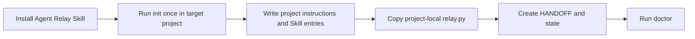
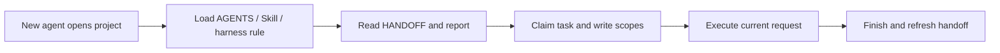
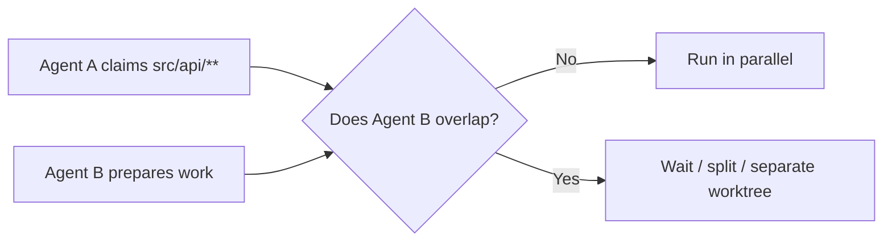

<p align="center">
  <a href="./README.md">简体中文</a> · <strong>English</strong>
</p>

<h1 align="center">Agent Relay</h1>

<p align="center"><strong>Let the next agent continue the project instead of asking everything again.</strong></p>

<p align="center">
  Install Agent Relay once to keep goals, active work, action records, instant reports, sealed versions, and multi-agent coordination inside the project.
</p>

<p align="center">
  
</p>

<p align="center">
  <a href="https://github.com/chopperH0824/agent-relay/actions/workflows/ci.yml"></a>
  <a href="https://github.com/chopperH0824/agent-relay/releases/latest"></a>
  <a href="./LICENSE"></a>
  <a href="https://github.com/chopperH0824/agent-relay/stargazers"></a>
  <a href="https://agentskills.io"></a>
</p>

[Latest release](https://github.com/chopperH0824/agent-relay/releases/latest) · [Natural-language use](#talk-to-the-agent) · [Uninstall and restore](#uninstall-and-restore) · [Visual architecture](./docs/agent-relay-simple.html) · [Protocol](./skills/agent-relay/references/PROTOCOL.md) · [Security boundary](./skills/agent-relay/references/SECURITY.md)

## Quick Start

Send this to your agent:

```text
Install and enable Agent Relay in this project: https://github.com/chopperH0824/agent-relay
```

Or install it yourself:

```bash
npx skills add chopperH0824/agent-relay --skill agent-relay
```

After a manual install, tell the agent:

> **Enable Agent Relay**

The agent reviews the Skill, identifies the current Harness, and previews the files it will write; you confirm once, then it initializes the project and runs its health check. Continue requesting work normally afterward. For a status update, just ask:

> **Where does this project stand?**

## Talk to the Agent

Users do not need to remember Relay commands. After installation, describe the intent in natural language:

- Continue work: **“Read the Agent Relay handoff, then continue implementing the export feature.”**
- Check status: **“Tell me where this project stands, what is blocked, and what comes next.”**
- Record a goal: **“Record ‘Complete v0.2’ as a long-term goal.”**
- Save a handoff point: **“Save the current handoff point with changed files, verification, and the next step.”**
- Coordinate agents: **“Check write-scope conflicts before splitting this work between two agents.”**
- Seal delivery: **“This is the final deliverable. Preview the scope, then seal `dist/final.pdf`.”**
- Check health: **“Check Agent Relay integrity, expired work, and sensitive-data warnings.”**
- Uninstall and restore: **“Uninstall Agent Relay and restore the project to a structure without Relay. Preview and explain every deletion and preservation first.”**

The agent translates intent into project-local operations. Historical goals provide context; the current request always has priority.

## Good Fit / Poor Fit

| Good fit | Poor fit |
| --- | --- |
| A project moves among Codex, Claude, Cursor, Pi, Qoder, TRAE, and other agents | A one-off conversation with no future handoff |
| You need an immediate answer to “where are we now?” | You want complete chat or hidden reasoning archives |
| Working drafts and delivered versions must remain distinct | You need a hosted project manager, team accounts, or remote database |
| Multiple agents may edit separate paths concurrently | You need strongly consistent locks across machines, NFS, or cloud-sync folders |
| The project itself should retain handoff capability | You expect project rules to bypass system, organization, or user policy |

> [!NOTE]
> **Current release: `v0.1.0`.** The Skill, initializer, and Python standard-library runtime are usable. CI covers Python 3.9, 3.11, and 3.13. Direct adapters can be generated and checked by `doctor`; whether a closed-source product loads an entry in a live session remains labeled separately by evidence level.

## What It Solves

Projects regularly move between models, desktop applications, and CLI agents. A new agent usually does not know:

- what the previous agent changed and verified;
- the current goal and next safe step;
- which version was delivered and which files are later drafts;
- which paths another agent is editing;
- which harness, model, or local capabilities supported earlier work;
- whether the current environment can reproduce that workflow.

Agent Relay keeps a small, explicit handoff layer inside the project so an agent reads operational facts before acting.

**Historical goals are reminders. The user's current explicit request always has priority.**

## Five Core Capabilities

| Capability | Automatic behavior | Problem addressed |
| --- | --- | --- |
| Handoff | Read `HANDOFF.md` and the concise report first | A new agent does not know current state |
| Record | Save result, files, verification, and next step at task end | Actionable context disappears with the chat |
| Report | Emit a fixed current-state summary with `relay report` | Status requires reading all history |
| Seal | Create a non-overwriting `vNNN` version at explicit delivery | Later edits overwrite delivered artifacts |
| Coordinate | Detect task-lease and write-scope conflicts | Multiple agents edit the same path |

## Why One Installation Is Enough

The Skill installs a minimal capability into the project:



Future sessions use project entries instead of invoking the installer again:



Agent Relay is not a daemon. It does not continuously consume CPU or listen on a port. The agent runs short commands when entering a project, starting work, checkpointing, finishing, and sealing.

## Installation

### Option A (recommended): let the agent install it

Use the message in [Quick Start](#quick-start). The agent should review [`SKILL.md`](./skills/agent-relay/SKILL.md) and the runtime before selecting the project-level entry for the current Harness. When it knows the Harness ID, it may add `--agent <id> --copy --yes` to `npx skills`; when detection is uncertain, it should preserve the installer's selection step instead of guessing a target directory.

This message explicitly authorizes installing Agent Relay, but the Harness may still request Shell-command approval. Project writes after installation still require Relay's dry-run and one confirmation; automatic installation does not bypass them.

### Option B: install manually in the current project

```bash
cd /path/to/project
npx skills add chopperH0824/agent-relay --skill agent-relay
```

The installer prompts for detected agents. You can target one explicitly:

```bash
DO_NOT_TRACK=1 npx skills add chopperH0824/agent-relay \
  --skill agent-relay \
  --agent codex \
  --copy \
  --yes
```

### Option C: global installer

Use the installer across multiple projects:

```bash
DO_NOT_TRACK=1 npx skills add chopperH0824/agent-relay \
  --skill agent-relay \
  --global
```

A global installation only makes the one-time installer discoverable. Each target project still requires one reviewed initialization.

### Option D: GitHub CLI

```bash
gh skill preview chopperH0824/agent-relay agent-relay
gh skill install chopperH0824/agent-relay agent-relay --scope user
```

Pin the supply-chain version to a release tag:

```bash
gh skill install chopperH0824/agent-relay agent-relay@v0.1.0 --scope user
```

`npx skills` is a third-party installer with anonymous telemetry; set `DO_NOT_TRACK=1` to disable it. `gh skill` requires GitHub CLI 2.90.0+ and is currently a preview feature. Review [`SKILL.md`](./skills/agent-relay/SKILL.md) and the runtime before installation.

## What Initialization Does

After installation, the user only needs to say:

> **Enable Agent Relay**

The agent follows a fixed safety sequence:

1. Confirm the project root and current Harness.
2. Run a read-only preview listing every create, modify, and skip path.
3. Explain managed blocks, backups, and adapter scope, then ask for one confirmation.
4. Apply the same plan, automatically matching Harness entries already present by default.
5. Run integrity checks and report the current state.

Adapter scope can also be requested in natural language:

- **“Install only the minimal universal entries.”** selects `minimal`.
- **“Automatically match the agents already used by this project.”** selects the default `auto` mode.
- **“Install entries for every supported Harness.”** selects `all`.

Initialization is idempotent: enabling it again updates the same managed block instead of appending copies. Existing files are backed up before changes. Symlinks, external paths, and existing non-Relay Skills are not overwritten.

## Daily Use

Continue describing work normally; users do not need to call Relay lifecycle commands. For example:

> **Read the project handoff, then implement the export endpoint without touching files another agent is editing.**

Project entries guide the agent to claim the task, capture the environment, and declare write scope in the background. Before pausing long work or changing agents, say:

> **Save the current handoff point with completed work, changed files, verification, and the next step.**

At completion, the agent records the result, verification, and next step, releases the write scope, and refreshes `HANDOFF.md`. Records contain operational facts only, never complete chats or hidden reasoning.

## Instant Status Report

Ask the agent directly:

> **Where does this project stand?**

Say **“Give me the full status”** for more detail, or **“Report Agent Relay status as JSON”** for a machine-readable result. The agent calls the read-only report, which does not claim work, renew leases, create events, or rewrite `HANDOFF.md`.

The default report stays near ten lines:

```text
Agent Relay report
Health: healthy
Project goal: Publish v0.1.0
Active work: task-id · owner · docs/**
Last completed: Installer and runtime tests passed
Version state: v001; unsealed changes: 2; storage: 18.4 KB
Environment: Pi · gpt-5.6 · shell, browser
Blockers: None
Next step: Create the GitHub Release
Updated: 2026-08-28T09:00:00Z · event-id
```

| Health | Meaning |
| --- | --- |
| `healthy` | State, entries, and leases are consistent |
| `stale` | State is readable, but a lease expired or HANDOFF trails the latest event |
| `degraded` | Required state, adapter, or environment reference is invalid or missing |
| `uninitialized` | No valid initialization exists in the project |

The machine contract follows [`report.schema.json`](./skills/agent-relay/assets/report.schema.json).

## Goals and Events

Add or update goals in natural language:

- **“Record ‘Complete v0.2’ as a long-term goal.”**
- **“Mark the API migration goal complete.”**
- **“Pause performance optimization; handle the production incident first.”**

User-stated goals are `explicit`; agent-inferred goals are only `candidate`. Goals can complete, pause, or be superseded, but they never override the current request.

Task starts, checkpoints, finishes, goal changes, initialization, and sealing each use one JSON file per event. Agents never append concurrently to one large log.

## Multi-Agent Coordination

Tell the coordinating agent:

> **Check write-scope conflicts before splitting API and documentation work between agents. If scopes overlap, split the task or use separate worktrees.**



| Situation | Behavior |
| --- | --- |
| Different tasks with disjoint writes | Run concurrently |
| Exact paths, globs, or literal prefixes overlap | Reject the second writer |
| Active lease expires | Mark it `expired`; allow an audited new task |
| A finished task is updated again | Reject duplicate completion |
| Read-only work | No write scope is required |
| Same module must change concurrently | Use separate Git worktrees, then review and merge |

v0.1 locks target a same-machine local filesystem. They do not promise cross-machine, NFS, Dropbox, or cloud-sync consistency.

## Version Sealing

Tell the agent exactly what is ready to deliver:

> **This is the final deliverable. Preview the seal scope, then seal `dist/final.pdf` with the label “Client delivery.”**

The agent seals only when the complete conversational meaning clearly requests finalization or immediate delivery. An isolated “looks good” with unclear scope requires a question first.

Results live under `.agent-relay/versions/v001/`, `v002/`, and so on and never overwrite older versions. Every copied file records its byte size and SHA-256; integrity checks detect tampering. A Git code project may seal only the current `HEAD` and worktree state. Agent Relay does not commit automatically.

The default artifact limit is 100 MiB. Symlinks, the project root, and `.agent-relay/` itself cannot be selected as deliverables.

## Uninstall and Restore

### Safe uninstall that preserves history

Tell the agent:

> **Uninstall Agent Relay. Preview first; remove its project entries and runtime while preserving goals, events, versions, and backups. Explain every deletion and preservation, then wait for my confirmation.**

After confirmation, the agent removes Relay managed blocks, unchanged owned adapters, and the project runtime. Adapters modified by the user are preserved and reported separately to prevent accidental deletion.

### Restore a structure without Relay

To remove history and the installed Skill as well, say:

> **Remove Agent Relay completely and restore this project to a structure without Relay. Preview first; after confirmation, uninstall project capability, delete Relay history, and remove the project-level Skill. Do not force-delete adapters I changed; report conflicts first.**

The agent should perform the safe uninstall, the doubly confirmed history purge, and then remove the project-level Skill according to the current Harness installation record. It removes a global Skill only when the user explicitly requests that scope.

> [!WARNING]
> A complete restore permanently deletes goals, events, sealed versions, and backups under `.agent-relay/`. It removes Agent Relay's own installation footprint; it does not undo business-code changes previously made by agents.

## Agent / Automation Command Reference

These are underlying interfaces called by the Skill and automation integrations, not commands users must memorize.

| Interface | Purpose | Mutates state? |
| --- | --- | --- |
| `init --dry-run` | Preview installation | No |
| `init --yes` | Install or update project capability | Yes |
| `start` | Create task, environment snapshot, and write lease | Yes |
| `checkpoint` | Save a handoff point and renew the lease | Yes |
| `finish` | Complete, block, or cancel work and release the lease | Yes |
| `goal` | Manage explicit or candidate goals | Depends on subcommand |
| `report [--full\|--json]` | Summarize the current project | No |
| `status [--json]` | Show canonical state | No |
| `doctor [--json]` | Check schema, entries, hashes, and secret patterns | No |
| `seal --yes` | Create a non-overwriting version | Yes |
| `uninstall --dry-run` | Preview uninstall and preservation scope | No |
| `uninstall --yes` | Remove project capability and preserve history | Yes |
| `purge --yes --confirm <project>` | Permanently delete Relay history | Yes, destructive |

Agents can read the installed [`SKILL.md`](./skills/agent-relay/SKILL.md) for the complete call sequence. Automation developers can run `python3 .agent-relay/relay.py --help` for every option.

## Files and Computer Changes

### Skill installation

The installer copies or links `skills/agent-relay/` into the selected harness's project or user Skill directory. The exact destination is controlled by the installer and its `--agent` / `--scope` options.

### Project initialization

Always created or maintained:

```text
project/
├── AGENTS.md
├── .agents/skills/agent-relay/SKILL.md
├── .gitignore
└── .agent-relay/
    ├── HANDOFF.md
    ├── relay.py
    ├── config.json
    ├── goals.json
    ├── tasks/
    ├── events/
    ├── versions/
    ├── environments/{shared,local}/
    ├── integrations/workbuddy/README.md
    ├── backups/
    └── runtime/
```

`auto` or `all` may also write:

- `CLAUDE.md`, `GEMINI.md`, and `CODEBUDDY.md`;
- `.cursor/rules/agent-relay.mdc`;
- `.github/copilot-instructions.md`;
- `.qoder/skills/`, `.trae/skills/`, `.codebuddy/skills/`, `.qwen/skills/`, and `.kimi/skills/`;
- `.opencode/skills/`, `.cline/skills/`, `.pi/skills/`, and `.windsurf/skills/`;
- `.roo/skills/`, `.kilocode/skills/`, `.continue/skills/`, `.kiro/skills/`, `.goose/skills/`, and `.openhands/skills/`.

Existing instruction files receive only this bounded block:

```text
<!-- agent-relay:start -->
...Agent Relay managed content...
<!-- agent-relay:end -->
```

Pre-change copies live under `.agent-relay/backups/<timestamp>/`. Machine paths, locks, backups, and version artifacts are Git-ignored by default.

## What It Does Not Do

By default, Agent Relay does not:

- request `sudo` or administrator privileges;
- install a daemon, startup item, or listening port;
- read Keychain, browser cookies, SSH private-key contents, or private chats from another harness;
- store tokens, passwords, cookies, private keys, complete environment variables, full chats, or hidden reasoning;
- upload projects or Relay state to an Agent Relay service;
- send telemetry;
- commit, push, open a PR, or publish automatically;
- modify user-level harness, shell, Git, SSH, or MCP configuration automatically;
- overwrite an existing non-Relay Skill, symlink, or sealed version;
- scan outside the confirmed project root.

Model providers, harnesses, GitHub, `npx skills`, and `gh skill` have their own network and telemetry policies.

## Privacy and Security

- Python standard-library runtime with no package dependency or runtime network call.
- Temporary-file, `fsync`, and atomic-rename writes for project state.
- Redaction of sensitive field names, private-key blocks, common token prefixes, and assignment forms before persistence.
- `doctor` scans shared state for private keys and common token patterns.
- Shareable environment facts remain separate from local machine paths.
- Sealed directories never overwrite; uninstall deletes an owned adapter only when its content hash remains unchanged.
- `purge` requires `--yes --confirm <project-directory-name>` together.

Read the full [Security and Privacy Reference](./skills/agent-relay/references/SECURITY.md).

## Harness Compatibility

“An official entry exists,” “an installer can place a Skill,” and “Agent Relay passed a live product test” are different claims. This repository labels them separately.

### v0.1 entries generated and covered by tests

| Product / harness | Entry | Current conclusion |
| --- | --- | --- |
| Codex, Cursor, Copilot, Gemini CLI, Amp, and shared-directory hosts | `AGENTS.md` + `.agents/skills/` | Generation, idempotency, and doctor checks tested |
| Claude Code | `CLAUDE.md` → `AGENTS.md` | Adapter generation tested; live loading depends on product policy |
| Gemini CLI | `GEMINI.md` → `AGENTS.md` | Adapter generation tested |
| Cursor | `.cursor/rules/agent-relay.mdc` | always-on Rule generation tested |
| GitHub Copilot | `.github/copilot-instructions.md` | Managed-block generation tested |
| Qoder / Qoder CN | `.qoder/skills/` + `AGENTS.md` | Official entry verified; adapter generation tested |
| TRAE Code / TraeWork | `.trae/skills/` + `AGENTS.md` | Official entry verified; local/cloud capability must be checked separately |
| CodeBuddy | `CODEBUDDY.md` + `.codebuddy/skills/` | Adapter generation tested |
| Qwen Code | `.qwen/skills/` | Official Agent Skills entry verified |
| Kimi Code CLI | `.kimi/skills/` + `.agents/skills/` | Official Agent Skills entry verified |
| OpenCode, Cline, Pi | Native Skill paths + `AGENTS.md` | Adapter generation tested; Pi installed through `npx skills` in an end-to-end check |

### Standard ecosystem entries

`--adapters all` also generates standard paths for Windsurf, Roo, Kilo, Continue, Kiro, Goose, and OpenHands. Aider, Factory Droid, Junie, Devin, Warp, Zed, Augment, Jules, and Antigravity can continue through `AGENTS.md` or universal `.agents/skills/`, but v0.1 does not call an ecosystem path a complete product regression.

### WorkBuddy and manual mode

Tencent WorkBuddy documents custom Skills based on `skill.yml`, implementation files, and a README, but its public guide does not expose a stable field-level schema. v0.1 does not invent one. `.agent-relay/integrations/workbuddy/README.md` instead describes a safe bridge: authorize one project folder and call `relay report --json` read-only.

Alibaba Lingma IDE remains distinct from Qoder CN CLI. Baidu Comate, CodeGeeX, CodeArts Snap, Fitten Code, and iFlyCode remain manual handoff targets until a stable official project Skill entry is verified.

See [Harness Adapter Reference](./skills/agent-relay/references/HARNESSES.md) for paths and evidence boundaries.

## Tests and Verification

Current coverage includes:

- Agent Skills directory and frontmatter;
- zero-write dry-run;
- idempotent managed blocks and backups;
- minimal, auto, and all adapters;
- task leases, expiry, and write-scope conflicts;
- zero state-file changes from `report`;
- goal lifecycle;
- secret redaction and doctor scan;
- artifact sealing, SHA-256, and tamper detection;
- safe uninstall and explicit purge;
- local `npx skills` discovery and Pi-directory installation.

```bash
python3 -m compileall -q skills/agent-relay/scripts tests
python3 -m unittest discover -s tests -v
DO_NOT_TRACK=1 npx --yes skills add . --list
```

GitHub Actions runs the same suite on Python 3.9, 3.11, and 3.13.


## Limitations

- Project rules are model context, not system enforcement; adherence differs among agents.
- v0.1 has no global hook or daemon. Project instructions guide lifecycle command calls.
- The agent interprets finalization semantics; the underlying `seal` command only accepts explicit parameters.
- Passing adapter tests does not mean every closed-source harness has completed a live-session regression.
- Inaccessible cross-application chats remain unknown.
- Write-scope conflict detection is deliberately conservative; complex globs may conflict.
- Local locks do not guarantee cross-machine or network-filesystem consistency.
- Artifacts are Git-ignored by default and consume local disk space.
- Skills execute with permissions granted by the agent; source review and normal command approval remain necessary.

## FAQ

### Must I invoke the Skill in every session?

No. The installed Skill performs the first `init`. `AGENTS.md`, the project bridge Skill, `HANDOFF.md`, and `.agent-relay/relay.py` retain capability afterward.

### Does it work without Git?

Yes. The confirmed current directory becomes the root. Sealing requires explicit artifacts, and Git state appears unavailable.

### Will it commit or push automatically?

No. It does not commit, push, open a PR, or publish unless the current user explicitly asks.

### Does “looks good” always seal a version?

No. It seals only when context clearly says the complete deliverable is ready now. Ambiguous scope requires confirmation.

### Why are report and status separate?

`report` is a fixed user-facing summary. `status` exposes underlying goals, tasks, events, versions, and adapters. `doctor` verifies installation and integrity.

### Does it store MCP tokens or SSH private keys?

No. v0.1 does not read private-key contents or copy complete MCP configuration and environment variables. Sensitive fields and common token forms are redacted before persistence.

### How do agents avoid editing the same file?

Every modifying task declares project-relative write scopes. A second overlapping active lease fails; agents must wait, split work, or use a separate worktree.

## Roadmap

- [x] Agent Skills standard layout and one-time installer Skill
- [x] Python standard-library project runtime
- [x] Dry-run, idempotent managed blocks, backups, atomic writes, and uninstall
- [x] Goals, task leases, events, environments, reports, and version sealing
- [x] Direct harness adapters and safe WorkBuddy manual bridge
- [x] Test matrix, MIT License, and first `v0.1.0` Release
- [ ] Add recorded live-session compatibility results for verified products
- [ ] Optional lifecycle hooks without silent global configuration changes
- [ ] `v0.2` schema migration and stronger cross-worktree coordination

## Documentation

- [Skill instructions](./skills/agent-relay/SKILL.md)
- [Protocol reference](./skills/agent-relay/references/PROTOCOL.md)
- [Harness reference](./skills/agent-relay/references/HARNESSES.md)
- [Security reference](./skills/agent-relay/references/SECURITY.md)
- [Simplified architecture](./docs/agent-relay-simple.md)
- [Visual architecture](./docs/agent-relay-simple.html)
- [Changelog](./CHANGELOG.md)
- [Contributing](./CONTRIBUTING.md)
- [Security policy](./SECURITY.md)

External standards: [Agent Skills Specification](https://agentskills.io/specification) · [GitHub CLI Skill](https://cli.github.com/manual/gh_skill) · [npx skills](https://github.com/vercel-labs/skills) · [AGENTS.md](https://agents.md/)

## License

[MIT](./LICENSE) © 2026 [chopperH0824](https://github.com/chopperH0824)
