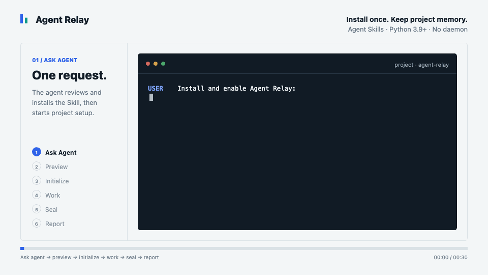
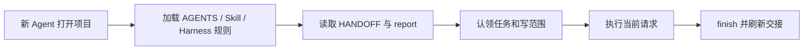
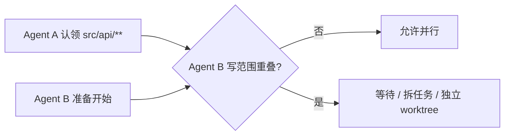

<p align="center">
  <strong>简体中文</strong> · <a href="./README.en.md">English</a>
</p>

<h1 align="center">Agent Relay</h1>

<p align="center"><strong>让下一个 Agent 直接接着做，而不是从头再问一遍。</strong></p>

<p align="center">
  Agent Relay 只安装一次，就把项目目标、当前任务、动作记录、状态快报、版本封存和多 Agent 协作能力留在项目里。
</p>

<p align="center">
  
</p>

<p align="center"><strong>推荐：把下面这条消息直接发给 Agent</strong></p>

```text
请帮我在当前项目
安装并启用 Agent Relay
GitHub:
chopperH0824/agent-relay
```

<p align="center">
  <a href="https://github.com/chopperH0824/agent-relay/actions/workflows/ci.yml"></a>
  <a href="https://github.com/chopperH0824/agent-relay/releases/latest"></a>
  <a href="./LICENSE"></a>
  <a href="https://github.com/chopperH0824/agent-relay/stargazers"></a>
  <a href="https://agentskills.io"></a>
</p>

[最新版本](https://github.com/chopperH0824/agent-relay/releases/latest) · [可视化架构](./docs/agent-relay-simple.html) · [完整协议](./skills/agent-relay/references/PROTOCOL.md) · [安全边界](./skills/agent-relay/references/SECURITY.md)

## Quick Start

在目标项目里，把上面那条消息发给有 Shell 和网络权限的 Agent。它会审查 Skill、识别当前 Harness、执行安装，并预览项目初始化范围；你只需要确认它展示的文件改动。

初始化完成后正常提需求即可。想看状态，直接问：

> **项目现在做到哪了？**

<details>
<summary><strong>手动安装（Agent 没有 Shell 或网络权限）</strong></summary>

```bash
npx skills add chopperH0824/agent-relay --skill agent-relay
```

安装后对 Agent 说：

> **启用 Agent Relay**

</details>

## 适用与不适用

| 适合 | 不适合 |
| --- | --- |
| 项目会在 Codex、Claude、Cursor、Pi、Qoder、TRAE 等 Agent 之间切换 | 只进行一次、无需后续接手的临时对话 |
| 需要快速回答“现在做到哪了” | 希望自动保存完整聊天或模型思维过程 |
| 需要区分工作稿和已交付版本 | 需要云端项目管理、团队账号或远程数据库 |
| 多个 Agent 可能并行修改不同文件 | 需要跨机器、NFS 或网盘目录的强一致分布式锁 |
| 希望项目自己长期保留交接能力 | 希望项目指令绕过系统、组织或用户权限策略 |

> [!NOTE]
> **当前正式版本：`v0.1.0`。** Skill、项目初始化器和 Python 标准库运行时已经可用。CI 覆盖 Python 3.9、3.11 和 3.13；直接适配器可以生成并由 `doctor` 校验，但封闭产品是否在真实会话中加载入口仍按兼容等级分别标注。

## 它解决什么问题

一个项目经常在不同时间交给不同模型、桌面应用或命令行 Agent。新的 Agent 通常不知道：

- 上一个 Agent 修改了什么、验证到哪里；
- 当前目标和下一步是什么；
- 哪个版本已经交付，哪些只是后续工作稿；
- 哪些文件正在被其他 Agent 修改；
- 历史流程依赖了什么 Harness、模型或本机能力；
- 当前环境是否能复用原来的做法。

Agent Relay 在项目里维护一个小而明确的交接层，让 Agent 先读取事实，再执行当前请求。

**历史目标只用于提醒。用户当前明确消息始终优先。**

## 五项核心能力

| 能力 | 自动行为 | 解决的问题 |
| --- | --- | --- |
| 自动接手 | 新 Agent 先读 `HANDOFF.md` 和只读快报 | 不知道前一个 Agent 做到哪里 |
| 自动记录 | 任务结束时记录结果、文件、验证和下一步 | 对话切换后丢失可执行上下文 |
| 快速汇报 | `relay report` 固定格式输出当前情况 | 为回答状态而翻阅全部历史 |
| 自动封版 | 明确交付时创建不可覆盖的 `vNNN` 版本 | 后续修改覆盖已交付成果 |
| 自动协调 | 任务租约和写入范围冲突检测 | 多 Agent 同时修改同一文件 |

## 为什么只安装一次

Skill 只负责把最小能力装入项目：


以后依靠项目入口继续运行，不依赖用户再次触发安装 Skill：



它不是后台守护进程，不持续占用 CPU，也不监听端口。Agent 只在进入项目、开始任务、检查点、完成任务和封版时运行短命令。

## 安装方式

### 方式 A（推荐）：由 Agent 安装

在目标项目中发送：

```text
请帮我在当前项目
安装并启用 Agent Relay
GitHub:
chopperH0824/agent-relay
```

Agent 应先审查 [`SKILL.md`](./skills/agent-relay/SKILL.md) 和运行脚本，再根据当前 Harness 选择项目级安装入口。知道 Harness ID 时可以为 `npx skills` 补充 `--agent <id> --copy --yes`；无法可靠识别时应保留安装器选择步骤，不要猜测目标目录。

这条消息明确授权安装 Agent Relay，但 Harness 仍可能要求批准 Shell 命令。安装后的项目文件写入继续遵循 Relay 的 dry-run 和一次确认，不会因为自动安装而跳过。

### 方式 B：手动安装到当前项目

```bash
cd /path/to/project
npx skills add chopperH0824/agent-relay --skill agent-relay
```

安装器会让你选择检测到的 Agent。也可以明确指定：

```bash
DO_NOT_TRACK=1 npx skills add chopperH0824/agent-relay \
  --skill agent-relay \
  --agent codex \
  --copy \
  --yes
```

### 方式 C：全局安装安装器

适合在多个项目中分别初始化：

```bash
DO_NOT_TRACK=1 npx skills add chopperH0824/agent-relay \
  --skill agent-relay \
  --global
```

全局安装只让 Agent 找到“一次性安装器”。每个目标项目仍需单独确认一次初始化范围。

### 方式 D：GitHub CLI

```bash
gh skill preview chopperH0824/agent-relay agent-relay
gh skill install chopperH0824/agent-relay agent-relay --scope user
```

可用发布标签固定供应链版本：

```bash
gh skill install chopperH0824/agent-relay agent-relay@v0.1.0 --scope user
```

`npx skills` 是第三方安装工具并包含匿名遥测；可用 `DO_NOT_TRACK=1` 关闭。`gh skill` 需要 GitHub CLI 2.90.0+，当前仍是 preview 功能。安装前请审查 [`SKILL.md`](./skills/agent-relay/SKILL.md) 和运行脚本。

## 初始化

Skill 会先运行无副作用预览：

```bash
python3 scripts/relay.py init \
  --project-root "/absolute/project/path" \
  --dry-run \
  --adapters auto
```

用户确认后才应用：

```bash
python3 scripts/relay.py init \
  --project-root "/absolute/project/path" \
  --adapters auto \
  --yes
```

三种适配模式：

| 模式 | 行为 |
| --- | --- |
| `minimal` | 只安装 `AGENTS.md`、通用 `.agents/skills/` 入口和 `.gitignore` 受管块 |
| `auto` | 在 minimal 基础上，根据项目中已有 Harness 目录和规则文件补适配器；默认值 |
| `all` | 生成 v0.1 提供的全部直接适配器，适合明确需要跨多 Harness 的项目 |

初始化是幂等的：重复执行会更新同一个受管块，不会追加副本。已有文件在修改前备份；符号链接、项目外路径和现有非 Relay Skill 不会被覆盖。

## 初始化后怎么用

用户继续像平常一样提需求。项目指令要求 Agent 在实质修改前认领任务：

```bash
python3 .agent-relay/relay.py start \
  --title "实现导出接口" \
  --owner "pi:session-12" \
  --scope "src/export/**" \
  --scope "tests/export/**"
```

长任务保存接手点：

```bash
python3 .agent-relay/relay.py checkpoint \
  --task-id "task-id" \
  --summary "导出逻辑完成，正在补错误分支" \
  --changed "src/export/service.py" \
  --verify "focused tests passed" \
  --next-step "补充超时测试"
```

结束时释放租约并刷新交接：

```bash
python3 .agent-relay/relay.py finish \
  --task-id "task-id" \
  --result "导出接口和错误处理已完成" \
  --changed "src/export/service.py" \
  --changed "tests/export/test_service.py" \
  --verify "python3 -m unittest passed" \
  --next-step "等待接口评审"
```

记录只包含可交接事实，不保存完整聊天或隐藏思维过程。

## 快速状态汇报

```bash
python3 .agent-relay/relay.py report
python3 .agent-relay/relay.py report --full
python3 .agent-relay/relay.py report --json
```

默认输出固定为 10 行左右：

```text
Agent Relay report
Health: healthy
Project goal: 发布 v0.1.0
Active work: task-id · owner · docs/**
Last completed: 安装器和运行时测试通过
Version state: v001; unsealed changes: 2; storage: 18.4 KB
Environment: Pi · gpt-5.6 · shell, browser
Blockers: None
Next step: 创建 GitHub Release
Updated: 2026-08-28T09:00:00Z · event-id
```

`report` 无副作用：不认领任务、不刷新租约、不创建事件、不改写 `HANDOFF.md`，并使用 Git 的 `--no-optional-locks` 模式读取工作区状态。

| 健康状态 | 含义 |
| --- | --- |
| `healthy` | 状态、入口和租约一致 |
| `stale` | 状态可读，但租约过期或 HANDOFF 落后 |
| `degraded` | 必要文件、适配器或环境引用损坏/缺失 |
| `uninitialized` | 当前项目没有有效初始化 |

机器接口遵循 [`report.schema.json`](./skills/agent-relay/assets/report.schema.json)。

## 目标与动作

```bash
python3 .agent-relay/relay.py goal add "完成 v0.2" \
  --kind explicit \
  --scope long-term

python3 .agent-relay/relay.py goal list
python3 .agent-relay/relay.py goal update "goal-id" --status completed
```

- 用户明确说出的目标标记为 `explicit`。
- Agent 推断的目标只能标记为 `candidate`。
- 目标可完成、暂停或被替代。
- 目标不能覆盖当前用户请求。

任务、检查点、完成、目标变化、初始化和封版都使用“一事件一 JSON 文件”，避免多个 Agent 同时追加一个大日志。

## 多 Agent 协作



| 情况 | 处理 |
| --- | --- |
| 不同任务，写范围不重叠 | 允许并行 |
| 路径、glob 或字面前缀重叠 | 阻止第二个写入者 |
| 活跃任务租约过期 | 标记 `expired`，新任务可审计式接手 |
| 已完成任务再次更新 | 拒绝，避免重复完成事件 |
| 只读任务 | 可以不声明 `--scope` |
| 必须并行改同一模块 | 使用独立 Git worktree 后审查合并 |

v0.1 的锁保证面向同一台电脑的本地文件系统；不承诺跨机器、NFS、Dropbox 或网盘同步目录的强一致性。

## 版本封存

Agent 只有在完整语义明确表示“现在定版/立即交付”时才执行封版。单独的“可以了”如果范围不清楚，必须先问。

先预览：

```bash
python3 .agent-relay/relay.py seal \
  --artifact "dist/final.pdf" \
  --dry-run
```

确认后创建不可覆盖版本：

```bash
python3 .agent-relay/relay.py seal \
  --artifact "dist/final.pdf" \
  --label "客户交付" \
  --summary "已确认的最终文件" \
  --yes
```

结果位于 `.agent-relay/versions/v001/`、`v002/` 等目录。每个复制文件记录大小和 SHA-256；`doctor` 会检查篡改。Git 代码项目也可以不复制文件，只封存当前 `HEAD` 和工作区状态；Agent Relay 不会自动 commit。

默认单次 artifact 上限为 100 MiB，符号链接、项目根目录和 `.agent-relay/` 自身不能作为交付范围。

## 命令

| 命令 | 作用 | 是否修改状态 |
| --- | --- | --- |
| `init --dry-run` | 预览安装计划 | 否 |
| `init --yes` | 安装或更新项目能力 | 是 |
| `start` | 创建任务、环境快照和写入租约 | 是 |
| `checkpoint` | 保存接手点并续租 | 是 |
| `finish` | 完成/阻塞/取消任务并释放租约 | 是 |
| `goal` | 管理明确或候选目标 | 视子命令 |
| `report [--full\|--json]` | 快速汇报当前情况 | 否 |
| `status [--json]` | 展开规范状态 | 否 |
| `doctor [--json]` | 检查 Schema、入口、校验值和秘密模式 | 否 |
| `seal --yes` | 创建不可覆盖版本 | 是 |
| `uninstall` | 移除受管入口和运行时，保留历史 | 是 |
| `purge` | 显式确认后永久删除 Relay 数据 | 是，破坏性 |

运行 `python3 .agent-relay/relay.py --help` 查看全部参数。

## 它会修改什么

### Skill 安装阶段

安装工具会把仓库中的 `skills/agent-relay/` 复制或链接到所选 Harness 的项目级或用户级 Skill 目录。具体位置由安装工具和 `--agent` / `--scope` 决定。

### `init` 阶段

始终创建或维护：

```text
project/
├── AGENTS.md
├── .agents/skills/agent-relay/SKILL.md
├── .gitignore
└── .agent-relay/
    ├── HANDOFF.md
    ├── relay.py
    ├── config.json
    ├── goals.json
    ├── tasks/
    ├── events/
    ├── versions/
    ├── environments/{shared,local}/
    ├── integrations/workbuddy/README.md
    ├── backups/
    └── runtime/
```

`auto` 或 `all` 还可能写入：

- `CLAUDE.md`、`GEMINI.md`、`CODEBUDDY.md`；
- `.cursor/rules/agent-relay.mdc`；
- `.github/copilot-instructions.md`；
- `.qoder/skills/`、`.trae/skills/`、`.codebuddy/skills/`、`.qwen/skills/`、`.kimi/skills/`；
- `.opencode/skills/`、`.cline/skills/`、`.pi/skills/`、`.windsurf/skills/`；
- `.roo/skills/`、`.kilocode/skills/`、`.continue/skills/`、`.kiro/skills/`、`.goose/skills/`、`.openhands/skills/`。

已有说明文件只插入以下边界块：

```text
<!-- agent-relay:start -->
...Agent Relay 管理内容...
<!-- agent-relay:end -->
```

修改前副本保存在 `.agent-relay/backups/<timestamp>/`。本机路径、锁、备份和版本 artifact 默认被 Git 忽略。

## 它不会做什么

Agent Relay 默认不会：

- 请求 `sudo` 或管理员权限；
- 安装后台服务、开机启动项或监听端口；
- 读取 Keychain、浏览器 Cookie、SSH 私钥内容或其他 Harness 私有聊天；
- 保存 Token、密码、Cookie、私钥、完整环境变量、完整对话或隐藏思维过程；
- 上传项目或 Relay 状态到 Agent Relay 服务器；
- 发送遥测；
- 自动 commit、push、创建 PR 或发布；
- 自动修改用户级 Harness、Shell、Git、SSH 或 MCP 配置；
- 覆盖现有非 Relay Skill、符号链接或已封版本；
- 扫描用户确认项目以外的文件。

模型提供商、Harness、GitHub、`npx skills` 和 `gh skill` 有各自的网络与遥测政策，不属于 Agent Relay。

## 隐私与安全

- Python 标准库实现，无运行时包依赖和网络请求。
- 所有项目写入使用临时文件、`fsync` 和原子改名。
- 敏感字段名、私钥块、常见 Token 前缀和赋值形式在落盘前脱敏。
- `doctor` 扫描共享状态中的私钥和常见 Token 模式。
- 共享环境和包含本机路径的 local 环境分开保存。
- 封版目录从不覆盖，卸载只删除内容哈希未变化的 owned adapter。
- `purge` 必须同时提供 `--yes --confirm <项目目录名>`。

详细威胁边界见 [Security and Privacy Reference](./skills/agent-relay/references/SECURITY.md)。

## Harness 兼容策略

“官方支持某种入口”“安装器能放入 Skill”“Agent Relay 已在真实产品中回归”是三件不同的事。本项目分别标注。

### v0.1 直接生成并由测试覆盖的入口

| 产品 / Harness | 入口 | 当前结论 |
| --- | --- | --- |
| Codex、Cursor、Copilot、Gemini CLI、Amp 等共享目录 Harness | `AGENTS.md` + `.agents/skills/` | 生成、幂等和 doctor 校验已测试 |
| Claude Code | `CLAUDE.md` → `AGENTS.md` | 适配文件生成已测试；真实加载依赖产品策略 |
| Gemini CLI | `GEMINI.md` → `AGENTS.md` | 适配文件生成已测试 |
| Cursor | `.cursor/rules/agent-relay.mdc` | always-on Rule 生成已测试 |
| GitHub Copilot | `.github/copilot-instructions.md` | 受管块生成已测试 |
| Qoder / Qoder CN | `.qoder/skills/` + `AGENTS.md` | 官方入口已核实；适配文件生成已测试 |
| TRAE Code / TraeWork | `.trae/skills/` + `AGENTS.md` | 官方入口已核实；本地/云端能力需分别验证 |
| CodeBuddy | `CODEBUDDY.md` + `.codebuddy/skills/` | 适配文件生成已测试 |
| Qwen Code | `.qwen/skills/` | 官方 Agent Skills 入口已核实 |
| Kimi Code CLI | `.kimi/skills/` + `.agents/skills/` | 官方 Agent Skills 入口已核实 |
| OpenCode、Cline、Pi | 各自 Skill 路径 + `AGENTS.md` | 适配文件生成已测试；Pi 通过 `npx skills` 实装测试 |

### 标准生态入口

`--adapters all` 还可以生成 Windsurf、Roo、Kilo、Continue、Kiro、Goose 和 OpenHands 的标准 Skill 路径。Aider、Factory Droid、Junie、Devin、Warp、Zed、Augment、Jules、Antigravity 等可继续使用 `AGENTS.md` 或通用 `.agents/skills/`，但 v0.1 不把“有生态路径”描述成完整产品回归。

### WorkBuddy 与手动模式

腾讯 WorkBuddy 的公开自定义 Skill 结构以 `skill.yml`、实现文件和 README 为主，但公开指南没有稳定字段级 Schema。v0.1 不生成猜测格式，只在 `.agent-relay/integrations/workbuddy/README.md` 提供安全桥接：授权单一项目文件夹，并只读调用 `relay report --json`。

通义灵码 IDE 与 Qoder CN CLI 分开识别。文心快码 Comate、CodeGeeX、CodeArts Snap、Fitten Code、iFlyCode 等未核实稳定项目 Skill 入口的产品保持手动交接模式，不声称自动加载。

完整路径和证据边界见 [Harness Adapter Reference](./skills/agent-relay/references/HARNESSES.md)。

## 测试与验证

当前测试覆盖：

- Agent Skills 目录和 frontmatter；
- dry-run 零写入；
- 幂等受管块和备份；
- minimal / auto / all 适配器；
- 任务租约、过期处理和写范围冲突；
- `report` 状态文件零变化；
- 目标生命周期；
- 秘密脱敏和 doctor 扫描；
- artifact 封版、SHA-256 与篡改检测；
- 安全卸载和显式 purge；
- `npx skills` 本地发现与 Pi 目录实装。

```bash
python3 -m compileall -q skills/agent-relay/scripts tests
python3 -m unittest discover -s tests -v
DO_NOT_TRACK=1 npx --yes skills add . --list
```

GitHub Actions 在 Python 3.9、3.11 和 3.13 上运行同一测试套件。

## 卸载与恢复

先预览：

```bash
python3 .agent-relay/relay.py uninstall --dry-run
```

再移除项目能力：

```bash
python3 .agent-relay/relay.py uninstall --yes
```

默认卸载会：

- 从说明文件中删除 Agent Relay 受管块；
- 删除内容未被本地修改的 owned adapter；
- 删除项目内 `relay.py`；
- 保留目标、事件、版本、HANDOFF 和备份；
- 保留本地修改过的 adapter 并报告原因。

彻底删除历史必须从安装 Skill 的脚本执行：

```bash
python3 scripts/relay.py purge \
  --project-root "/absolute/project/path" \
  --yes \
  --confirm "project-directory-name"
```

移除全局 Skill 不会改动已经初始化的项目：

```bash
npx skills remove --global agent-relay
```

通过 GitHub CLI preview 安装时，先运行 `gh skill list` 定位当前 Harness 目录，再按该 Harness 的目录规则移除；当前 `gh skill` 手册尚未提供 remove 子命令。

## 限制

- 项目规则是模型上下文，不是系统级强制策略；不同 Agent 的遵从程度可能不同。
- v0.1 没有全局 Hook 或后台进程，生命周期动作由项目指令引导 Agent 调用。
- 语义封版由 Agent 判断；底层 `seal` 只接受明确参数，不自行分析聊天。
- Harness 适配文件通过测试不等于每个闭源产品都完成真实会话回归。
- 无法访问的跨应用聊天保持未知，不会自动恢复。
- 写范围冲突检测故意偏保守，复杂 glob 可能被视为冲突。
- 本地锁不保证跨机器或网络文件系统强一致。
- artifact 默认不提交 Git，且会占用本地磁盘。
- Skill 本身拥有 Agent 授予的执行能力；安装前仍需代码审查和 Harness 命令批准。

## FAQ

### 初始化后每次都要调用 Skill 吗？

不用。安装 Skill 只负责第一次 `init`。项目中的 `AGENTS.md`、项目级桥接 Skill、`HANDOFF.md` 和 `.agent-relay/relay.py` 维持后续能力。

### 可以不使用 Git 吗？

可以。没有 Git 时使用当前确认目录作为根；封版必须明确提供 artifact，Git 状态显示为 unavailable。

### 会自动提交和推送吗？

不会。除非当前用户请求明确要求，否则 Agent Relay 不执行 commit、push、PR 或发布。

### “可以了”一定自动封版吗？

不一定。只有上下文明确表示完整交付物现在可以交付时才封版；范围不明必须先询问。

### 为什么 report 和 status 分开？

`report` 面向用户，固定输出当前情况；`status` 展开底层目标、任务、事件、版本和适配器；`doctor` 验证安装与完整性。

### 它会保存 MCP Token 或 SSH 私钥吗？

不会。v0.1 不读取私钥内容，不复制完整 MCP 配置或环境变量；敏感字段和常见 Token 形式在落盘前脱敏。

### 多 Agent 如何避免撞文件？

每个修改任务先声明项目相对写范围。活跃租约重叠时第二个任务失败，需等待、拆分或使用独立 worktree。

## 路线图

- [x] Agent Skills 标准目录和一次性安装 Skill
- [x] Python 标准库项目运行时
- [x] dry-run、幂等受管块、备份、原子写入和卸载
- [x] 目标、任务租约、事件、环境、快报和封版
- [x] 直接 Harness 适配器与 WorkBuddy 手动桥接
- [x] 测试矩阵、MIT License 和首个 `v0.1.0` Release
- [ ] 为已核实产品增加真实会话兼容回归记录
- [ ] 可选生命周期 Hook，不静默修改全局配置
- [ ] `v0.2` Schema 迁移与跨 worktree 协调增强

## 文档

- [Skill instructions](./skills/agent-relay/SKILL.md)
- [Protocol reference](./skills/agent-relay/references/PROTOCOL.md)
- [Harness reference](./skills/agent-relay/references/HARNESSES.md)
- [Security reference](./skills/agent-relay/references/SECURITY.md)
- [简化架构规格](./docs/agent-relay-simple.md)
- [可视化架构](./docs/agent-relay-simple.html)
- [Changelog](./CHANGELOG.md)
- [Contributing](./CONTRIBUTING.md)
- [Security policy](./SECURITY.md)

外部规范：[Agent Skills Specification](https://agentskills.io/specification) · [GitHub CLI Skill](https://cli.github.com/manual/gh_skill) · [npx skills](https://github.com/vercel-labs/skills) · [AGENTS.md](https://agents.md/)

## License

[MIT](./LICENSE) © 2026 [chopperH0824](https://github.com/chopperH0824)
