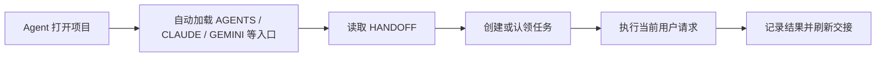
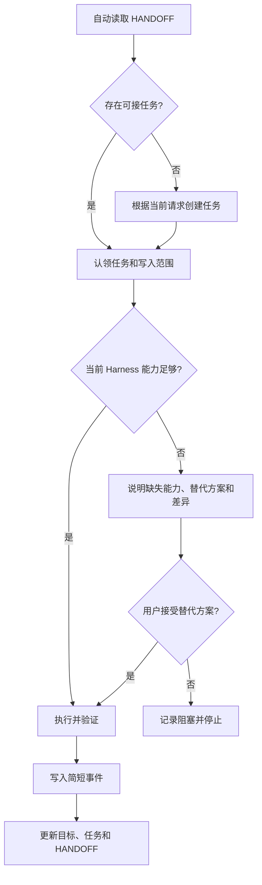
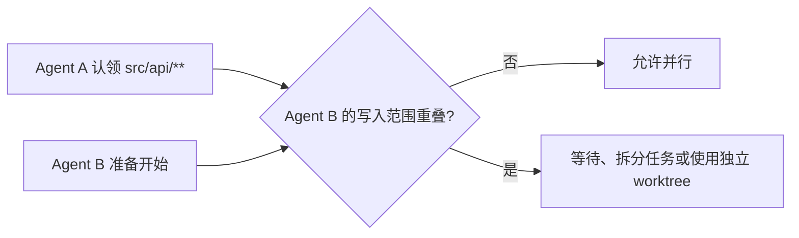

<p align="center">
  <strong>简体中文</strong> · <a href="./README.en.md">English</a>
</p>

<h1 align="center">Agent Relay</h1>

<p align="center">
  一次安装，把可持续的项目交接、版本记录和多 Agent 协作留在项目里。
</p>

<p align="center">
  
  
  
</p>

> [!IMPORTANT]
> **当前状态：规格设计阶段。** 仓库目前包含完整设计说明和可视化原型，但还没有可执行的 `SKILL.md`、安装器或 Relay CLI。本文中的安装命令和运行行为描述的是计划中的 `v0.1` 接口，正式发布前不要把它们用于生产项目。

Agent Relay 的目标不是要求用户在每次对话中主动调用一个 Skill。它把 Skill 定位为**一次性项目安装器**：首次执行后，将项目级入口、轻量运行脚本和交接状态安装到当前项目。此后 Agent 通过项目自身的说明文件自动发现并执行交接协议。

- **Skill 负责安装。**
- **项目负责长期保持能力。**
- **用户之后照常提出需求，不需要再次主动触发 Skill。**

[查看可视化架构](./docs/agent-relay-simple.html) · [查看简化规格](./docs/agent-relay-simple.md) · [桌面预览](./docs/agent-relay-desktop.jpg) · [手机预览](./docs/agent-relay-mobile.jpg)

## 目录

- [Agent Relay 解决什么问题](#agent-relay-解决什么问题)
- [四项核心能力](#四项核心能力)
- [为什么执行一次后可以持续生效](#为什么执行一次后可以持续生效)
- [安装与首次初始化](#安装与首次初始化)
- [初始化完成后怎么做](#初始化完成后怎么做)
- [它会对电脑做什么](#它会对电脑做什么)
- [它不会对电脑做什么](#它不会对电脑做什么)
- [项目内文件结构](#项目内文件结构)
- [日常工作流程](#日常工作流程)
- [目标、动作、版本和环境记录](#目标动作版本和环境记录)
- [多 Agent 协作](#多-agent-协作)
- [Harness 兼容策略](#harness-兼容策略)
- [隐私与安全](#隐私与安全)
- [计划中的命令](#计划中的命令)
- [卸载与恢复](#卸载与恢复)
- [限制](#限制)
- [常见问题](#常见问题)
- [路线图](#路线图)

## Agent Relay 解决什么问题

同一个项目经常在不同时间交给不同模型、桌面应用或命令行 Agent。新的 Agent 通常无法可靠知道：

- 用户对整个项目的长期目标是什么；
- 上一个 Agent 刚刚修改了什么、验证到哪里；
- 哪个版本已经发给领导、同事或客户；
- 哪些文件正在被另一个 Agent 修改；
- 历史流程依赖了什么模型、MCP、插件、浏览器或本机工具；
- 当前 Harness 是否拥有相同能力，能否复用历史流程。

Agent Relay 在项目中维护一个小而明确的交接层，使下一位 Agent 能先读取事实，再开始执行当前请求。

历史目标只用于提醒，不具有强制性。**用户当前明确消息始终优先。**

## 四项核心能力

| 能力 | 自动行为 | 目的 |
| --- | --- | --- |
| 自动接手 | 新 Agent 开始前先读取 `HANDOFF.md` | 知道项目现状、进行中任务和下一步 |
| 自动记录 | 任务结束时记录问题、动作、结果与验证 | 为临时接手提供足够事实，而不是保存完整聊天 |
| 自动封版 | 识别明确的定版或立即交付语义 | 留下不可变版本，防止后续修改覆盖交付成果 |
| 自动协调 | 认领任务和写入范围，比较环境能力 | 避免多 Agent 冲突，并发现工具能力差异 |

## 为什么执行一次后可以持续生效

普通 Skill 通常按需加载，不能保证每次会话都被模型主动选择。Agent Relay 的首次执行会把一个最小常驻层写入项目：


后续会话依赖 Harness 自动加载的项目指令，而不是依赖用户想起 Skill：



这不是后台守护进程。Agent Relay 不会一直占用 CPU 或监听端口；它由 Agent 根据项目入口，在会话开始、任务完成和封版时调用项目内脚本。

## 安装与首次初始化

### 当前版本说明

以下是计划中的 `v0.1` 使用方式。仓库发布有效的 `SKILL.md` 和安装脚本后才可以执行。

### 方式 A：安装到当前项目

适合只在一个项目中使用：

```bash
cd /path/to/your-project
npx skills add chopperH0824/agent-relay --skill agent-relay
```

`npx skills` 是第三方 Agent Skills 安装工具，不属于 Agent Relay。它默认把 Skill 安装到项目支持的 Skill 目录，并让用户选择目标 Agent。

如需关闭该第三方工具自己的匿名遥测，可使用：

```bash
DO_NOT_TRACK=1 npx skills add chopperH0824/agent-relay --skill agent-relay
```

### 方式 B：全局安装，再初始化多个项目

适合在多项目中重复使用安装器：

```bash
DO_NOT_TRACK=1 npx skills add chopperH0824/agent-relay --skill agent-relay --global
```

全局安装只让 Harness 能找到“安装 Skill”。每一个目标项目仍需单独执行一次初始化。

### 在目标项目执行一次初始化

打开目标项目后，对 Agent 说：

```text
使用 agent-relay 初始化当前项目。先展示 dry-run，说明将创建和修改的每个文件，得到我的确认后再执行。
```

支持 Skill 命令的 Harness 也可以使用计划中的命令：

```text
/agent-relay init --dry-run
/agent-relay init
```

初始化器应当：

1. 确认当前目录或 Git 根目录是正确项目。
2. 扫描已有项目指令，避免覆盖用户内容。
3. 展示将创建、修改、备份和忽略的路径。
4. 获得批准后写入项目常驻能力。
5. 执行 `doctor`，验证入口与状态文件可读。
6. 生成第一次 `HANDOFF.md`；识别不到目标时保持空白。

## 初始化完成后怎么做

初始化成功后，用户只需要做三件事：

1. 查看 `.agent-relay/HANDOFF.md`，确认项目简介和已识别目标是否准确。
2. 根据需要补充长期目标；没有全局目标可以继续留空。
3. 继续像平常一样向任何 Agent 提需求。

以后不需要重复输入 `/agent-relay`。新的 Agent 应当自动：

- 读取交接总览；
- 检查是否存在进行中的任务和文件占用；
- 记录本次 Harness、模型和可用能力；
- 完成用户任务；
- 写入简短动作记录并刷新交接；
- 在明确要定版或立即发送时创建版本副本。

可以随时执行计划中的检查命令：

```bash
python .agent-relay/relay.py status
python .agent-relay/relay.py doctor
```

## 它会对电脑做什么

下面描述的是默认、安全模式的目标行为。所有写入都应限定在用户确认的项目根目录；只有用户主动选择全局安装 Skill 时，才会写入用户级 Skill 目录。

### 1. 安装 Skill 时

根据所选 Harness 和安装范围，Agent Skills 安装工具可能在以下位置之一写入 Agent Relay Skill：

| 范围 | 示例路径 | 作用 |
| --- | --- | --- |
| 项目级 | `.agents/skills/agent-relay/`、`.claude/skills/agent-relay/`、`.cursor/skills/agent-relay/` | 只在当前项目提供首次安装能力 |
| 用户级 | `~/.agents/skills/agent-relay/`、`~/.claude/skills/agent-relay/`、`~/.codex/skills/agent-relay/` | 可在多个项目调用安装器 |

具体路径由 Harness 或 Skill 安装工具决定。安装第三方 Skill 前应先审查 `SKILL.md` 和脚本。

### 2. 在项目执行 `init` 时读取的信息

| 读取项 | 用途 | 是否保存原文 |
| --- | --- | --- |
| 当前目录、Git 根目录 | 确定安装边界 | 只记录规范化项目路径 |
| 已有 `AGENTS.md`、`CLAUDE.md`、`GEMINI.md` 和适配规则 | 合并入口并避免覆盖 | 仅用于生成受管标记块 |
| Git 状态、当前分支和最近提交 ID | 记录项目基线 | 保存必要摘要，不自动提交 |
| 操作系统、CPU 架构、Shell、Python/Git 路径 | 建立环境快照 | 保存脱敏元数据 |
| 可发现的 Harness、Skill、MCP 和插件清单 | 判断历史流程能否复用 | 保存名称、版本和配置路径，不保存密钥值 |
| `~/.ssh/config` 中的 Host alias 与 `IdentityFile` 路径 | 提示可用远程连接方式 | 仅在用户允许本机工具扫描时读取；不打开私钥 |

环境扫描分为两级：

- **默认：元数据扫描。** 读取版本、命令路径和项目内可见配置。
- **可选：本机工具扫描。** 经用户批准后，读取已知 MCP、插件和 SSH 配置中的非秘密字段。

### 3. 在项目中创建的内容

| 路径 | 默认行为 | 用途 |
| --- | --- | --- |
| `.agent-relay/HANDOFF.md` | 创建并自动刷新 | 新 Agent 第一时间读取的短总览 |
| `.agent-relay/relay.py` | 创建 | 无第三方依赖的项目内运行脚本 |
| `.agent-relay/config.json` | 创建 | Schema 版本、适配器和记录策略 |
| `.agent-relay/goals.json` | 创建，可为空 | 长期、短期和候选目标 |
| `.agent-relay/tasks/` | 创建 | 一任务一文件，包含认领和写入范围 |
| `.agent-relay/events/` | 创建 | 一事件一文件，避免并发追加冲突 |
| `.agent-relay/versions/` | 创建 | 已封版交付物、校验值和版本历程 |
| `.agent-relay/environments/` | 创建 | 脱敏后的环境与能力快照 |
| `.agent-relay/runtime/` | 创建并 Git 忽略 | 锁、租约、缓存和本机临时状态 |
| `.agent-relay/backups/` | 初始化修改已有文件时创建 | 保存修改前副本，便于恢复 |

### 4. 可能修改的项目文件

Agent Relay 不应整文件覆盖，而是在现有文件中维护带边界的标记块：

```text
<!-- agent-relay:start -->
...由 Agent Relay 管理的项目交接入口...
<!-- agent-relay:end -->
```

| 文件 | 修改方式 | 原因 |
| --- | --- | --- |
| `AGENTS.md` | 不存在则创建；存在则插入受管块 | 跨 Harness 主入口 |
| `CLAUDE.md` | 按需创建或加入 `@AGENTS.md` 引用 | Claude Code 不直接读取 `AGENTS.md` 时适配 |
| `GEMINI.md` | 按需创建或导入 `AGENTS.md` | Gemini 项目上下文适配 |
| `.cursor/rules/agent-relay.mdc` | 检测到 Cursor 或选择全适配时创建 | 增强 Cursor 的常驻加载 |
| `.github/copilot-instructions.md` | 仅在需要兼容旧配置时插入受管块 | GitHub Copilot 适配 |
| `.gitignore` | 插入受管忽略块 | 排除锁、缓存、本机路径和可选版本副本 |

所有修改在写入前生成备份。重复运行 `init` 必须是幂等的，不重复插入标记块。

### 5. 日常任务期间的写入

- 创建或更新本次任务文件；
- 创建简短事件记录；
- 更新环境快照引用；
- 原子刷新 `HANDOFF.md`；
- 释放任务租约；
- 用户明确封版时，将选定交付物复制到版本目录并计算 SHA-256；
- 不默认复制整个仓库。

版本副本会占用磁盘空间。`status` 应展示版本目录大小，清理任何已封版本必须要求明确确认。

## 它不会对电脑做什么

默认模式下，Agent Relay **不会**：

- 请求 `sudo`、管理员权限或系统扩展权限；
- 安装开机启动项、LaunchAgent、Windows 服务、计划任务或后台守护进程；
- 长期监听端口、键盘、鼠标、剪贴板或浏览器活动；
- 读取 macOS Keychain、系统凭据库、浏览器 Cookie 或登录会话；
- 读取 SSH 私钥内容；
- 保存 Token、密码、Cookie、私钥、完整环境变量值或 MCP 密钥；
- 上传项目、交接记录或环境快照到 Agent Relay 服务器；
- 发送遥测；
- 自动执行 `git commit`、`git push`、创建 PR 或发布版本；
- 自动修改用户级 Harness、MCP、Shell、Git 或 SSH 配置；
- 删除已有项目文件或覆盖已封版本；
- 读取其他 Harness 的私有聊天历史；
- 保存模型的隐含思维过程或完整对话副本。

Skill 下载工具、GitHub、模型提供商和用户正在使用的 Harness 可能各自有网络和遥测策略，它们不属于 Agent Relay。README 会尽量明确区分这些边界。

## 项目内文件结构

```text
project/
├── AGENTS.md
├── CLAUDE.md                       # 按需
├── GEMINI.md                       # 按需
├── .agents/
│   └── skills/
│       └── agent-relay/            # 可选的项目级桥接 Skill
└── .agent-relay/
    ├── HANDOFF.md
    ├── relay.py
    ├── config.json
    ├── goals.json
    ├── tasks/
    ├── events/
    ├── versions/
    ├── environments/
    │   ├── shared/
    │   └── local/
    ├── backups/
    └── runtime/
```

推荐的数据边界：

| 类型 | 是否适合提交 Git | 示例 |
| --- | --- | --- |
| 共享交接事实 | 是，经过脱敏后 | `HANDOFF.md`、目标、任务结果、版本清单 |
| 本机环境 | 否 | 用户目录路径、本机 Harness 安装位置、SSH IdentityFile 路径 |
| 运行时协调 | 否 | 锁、租约、PID、缓存 |
| 大型版本副本 | 默认否 | PPT、视频、压缩包等交付物副本 |

## 日常工作流程



每次记录只包含可交接事实：问题摘要、采取的动作、修改文件、验证结果、遗留事项和下一步。它不应记录逐步思维链。

## 目标、动作、版本和环境记录

### 目标

- 没有识别到全局目标时保持空白。
- 用户明确表达的目标标记为 `explicit`。
- Agent 推断出的目标只标记为 `candidate`，不能假装用户已经确认。
- 目标分长期和短期，可以暂停、完成或被后续目标替代。
- 目标只用于防止遗忘，不用于拒绝当前请求。

### 动作

任务开始、重要检查点、任务完成或发生阻塞时记录：

- 用户问题的简短摘要；
- 可公开解释的方案和关键决策；
- 创建、修改和删除的文件；
- 关键命令及验证结果；
- 当前状态、阻塞原因和下一步；
- Harness、模型、会话和环境快照引用。

### 版本

只有完整语义表示“现在需要交付”时才自动封版：

| 用户表达 | 默认行为 |
| --- | --- |
| “定版”“最终版”“就按这个发” | 自动封版 |
| “现在发给领导/同事/客户” | 发送前自动封版 |
| “可以了”“就这样” | 结合上下文；范围不明确时询问 |
| “以后要发”“先继续改” | 不封版 |

封版流程：识别交付范围 → 临时复制 → 计算校验值 → 汇总自上个版本以来的事件 → 原子保存为 `v001`、`v002` → 继续维护工作副本。

对于代码项目，默认记录 Git 提交引用或工作区清单，不自动创建提交。对于 Office、图片、音视频等二进制交付物，保存选定文件的实际副本。

### 环境

每次动作只引用环境快照 ID。只有环境发生变化时才创建新快照。

可记录：

- 操作系统、架构、Shell、Harness 和模型；
- 可用工具能力，例如 Shell、浏览器、computer use、网络、Office、图片生成；
- Skill、MCP、插件的名称、版本和脱敏配置路径；
- Git、SSH 命令路径、SSH Host alias、公钥指纹和最近验证时间。

如果历史任务依赖 `computer-use`，当前 Harness 只有 DOM 浏览器工具，Agent 必须说明缺少的能力、最近替代方案及结果差异，并在采用实质不同的方法前取得用户同意。

## 多 Agent 协作

每个任务包含唯一 ID、负责人、状态、依赖、租约、心跳和写入范围。



| 情况 | 处理 |
| --- | --- |
| 不同任务且写入范围不重叠 | 允许并行 |
| 写入范围重叠 | 阻止第二个写入者 |
| 原 Agent 长时间无心跳 | 租约过期后记录原因并接管 |
| 必须同时修改同一模块 | 使用独立 Git worktree，再审查合并 |
| 只读取同一文件 | 允许并行 |

同一工作目录只适合并行修改互不重叠的路径。网络文件系统、云盘同步目录和跨机器锁不属于首版可靠性范围。

## Harness 兼容策略

Agent Skills 和项目指令在不同 Harness 中的加载方式不完全一致，因此 Agent Relay 使用“统一状态 + 薄适配器”：

| Harness / 类别 | 计划入口 | 说明 |
| --- | --- | --- |
| Codex | `AGENTS.md` | 会话启动时读取项目指令链 |
| Claude Code | `CLAUDE.md` → `@AGENTS.md` | Claude Code 不直接使用 `AGENTS.md` 时导入 |
| Cursor | `AGENTS.md` + `.cursor/rules/agent-relay.mdc` | 项目规则用于增强常驻加载 |
| Gemini CLI | `GEMINI.md` → `@./AGENTS.md` | 也可配置 context filename |
| GitHub Copilot | `AGENTS.md`，必要时 Copilot instructions | 兼容 Agent 与代码审查入口 |
| Cline | `AGENTS.md` | Cline 可识别跨工具项目规则 |
| Pi | 项目 Skill + `AGENTS.md` | 通过 Agent Skills 和项目指令接入 |
| 其他 Agent Skills / AGENTS.md 兼容工具 | `.agents/skills/` + `AGENTS.md` | 使用标准入口，运行 `doctor` 验证 |

“兼容”表示提供适配路径，不代表项目文件能覆盖 Harness 的系统策略。系统、组织策略和用户当前明确消息拥有更高优先级。

## 隐私与安全

安全默认值：

- 安装前显示 dry-run；
- 不在 `SKILL.md` 中预批准不受限制的 Shell；
- 所有写入限定在确认后的项目根目录；
- 解析结构化配置，而不是复制整个配置文件；
- 字段名命中 `token`、`secret`、`password`、`cookie`、`private_key` 等时拒绝落盘；
- 共享环境和本机环境分开；
- 一事件一文件，采用临时文件 + 原子改名；
- 封版目录不可覆盖；
- 已有说明文件修改前备份；
- 不提供 Agent Relay 云端服务，不自动上传数据。

仍需注意：任何 Skill 都可能指示 Agent 执行命令。安装前必须审查来源、`SKILL.md` 和脚本，并保留 Harness 的命令批准机制。

## 计划中的命令

| 命令 | 作用 |
| --- | --- |
| `relay init --dry-run` | 预览将发生的所有读取和写入 |
| `relay init` | 为当前项目安装常驻能力 |
| `relay start` | 建立会话环境、创建或认领任务 |
| `relay checkpoint` | 长任务中记录安全接手点 |
| `relay finish` | 记录结果、释放任务并刷新交接 |
| `relay seal` | 创建不可变版本及版本历程 |
| `relay status` | 查看目标、任务、冲突、版本和最近动作 |
| `relay doctor` | 验证入口、Schema、权限和 Harness 适配 |
| `relay uninstall` | 移除受管入口与运行时，默认保留历史数据 |
| `relay purge` | 明确确认后删除交接数据和版本副本 |

首版计划使用 Python 标准库实现，不要求项目安装额外 Python 包。最低 Python 版本会在实现完成后确定。

## 卸载与恢复

计划中的安全卸载流程：

```bash
python .agent-relay/relay.py uninstall --dry-run
python .agent-relay/relay.py uninstall
```

默认卸载只会：

- 删除 Agent Relay 写入的受管标记块；
- 删除项目级桥接 Skill 和运行脚本；
- 保留 `events/`、`versions/`、`goals.json` 和备份；
- 不删除用户原有项目指令。

彻底删除历史数据必须使用独立的 `purge` 操作并明确确认。

若 Skill 是全局安装的，可通过安装工具移除：

```bash
npx skills remove --global agent-relay
```

卸载全局 Skill 不会自动修改已经初始化的项目；项目能力和项目数据由各项目单独卸载。

## 限制

- 项目指令属于上下文，不是系统级强制策略；不同模型的遵从程度可能不同。
- 部分 Harness 只有 Hook 才能保证固定生命周期动作，Hook 将作为可选增强，而不是默认修改全局配置。
- Agent Relay 无法通用读取 Codex、Claude、Cursor 等产品之间的私有历史对话。
- Agent 无法访问的信息必须标记为未知，不能推断成事实。
- 语义封版存在歧义时必须询问，不能仅依赖关键词。
- 首版并发保证面向同一台电脑的本地文件系统；不承诺 Dropbox、网盘、NFS 或跨机器强一致锁。
- 大型二进制版本会占用磁盘空间，默认只保存明确交付物。
- 当前仓库尚未发布可执行版本。

## 常见问题

### 初始化后还要每次调用 Skill 吗？

不需要。首次初始化会把入口和运行时留在项目中。以后 Harness 自动读取项目指令，由 Agent 调用项目内运行时。

### 它是否一直在后台运行？

不是。没有守护进程、监听端口或开机启动项。只有 Agent 开始、检查点、完成和封版时执行短命令。

### 它会把项目上传到云端吗？

Agent Relay 本身不会。你使用的模型、Harness、Git 托管和 Skill 下载工具可能有自己的网络策略，应分别审查。

### 它会修改现有 `AGENTS.md` 吗？

会，但只插入有明确起止标记的受管块，并在修改前备份。卸载时只移除该受管块。

### 没有 Git 可以使用吗？

计划支持。没有 Git 时以当前目录作为项目根，并使用文件清单和哈希记录版本；Git 相关能力会标记为不可用。

### 会自动提交或推送代码吗？

不会。除非用户在当前请求中明确要求，否则不会执行 commit、push、PR 或发布。

### 能读取以前在其他 AI 应用里的聊天吗？

通常不能。初始化只读取项目中可访问的事实和经授权的本地元数据。不可访问的历史保持空白。

### “可以了”一定会触发定版吗？

不一定。只有上下文明确表示整个交付物可以立即交付时才封版；否则询问范围。

### 如何防止两个 Agent 同时修改同一文件？

Agent 开始前认领任务和写入范围。重叠写入会被阻止；需要并行时使用拆分任务或独立 worktree。

### 环境记录会保存 SSH 私钥或 MCP Token 吗？

不会。只记录允许的名称、版本、路径和指纹；秘密字段和私钥内容禁止落盘。

## 路线图

- [x] 简化架构与数据边界
- [x] 桌面、移动端可视化说明
- [x] 双语 GitHub README
- [ ] 符合 Agent Skills 规范的 `SKILL.md`
- [ ] 幂等安装器、dry-run、备份和卸载
- [ ] 文件式事件、任务租约和路径冲突检测
- [ ] 目标、环境快照和能力差异协商
- [ ] 不可变版本封存和校验
- [ ] Codex、Claude Code、Cursor、Gemini、Copilot、Cline、Pi 适配测试
- [ ] 单元测试、故障恢复测试和首次 `v0.1.0` 发布

## 文档

- [简化架构规格](./docs/agent-relay-simple.md)
- [可视化架构页面](./docs/agent-relay-simple.html)
- [Agent Skills Specification](https://agentskills.io/specification)
- [AGENTS.md](https://agents.md/)
- [skills CLI](https://github.com/antfu/skills-cli)

## 贡献与许可

在首个可执行版本完成前，Issue 和设计反馈是最有价值的贡献。涉及安装器、安全边界、Harness 兼容或数据 Schema 的更改，应同时补充测试和中英文文档。

本仓库当前尚未添加开源许可证。在许可证明确之前，不应假定仓库内容已获得复制、修改或再分发授权。
