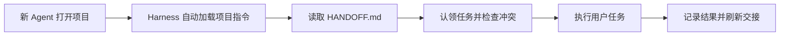
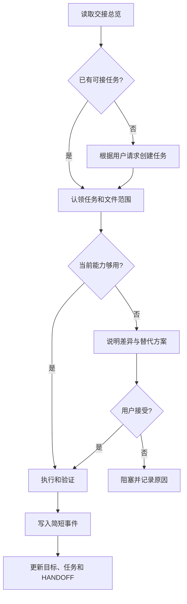
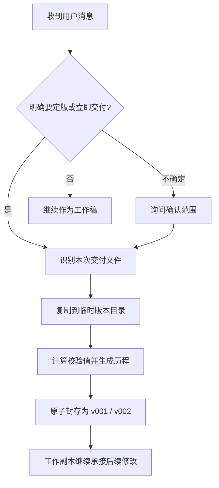
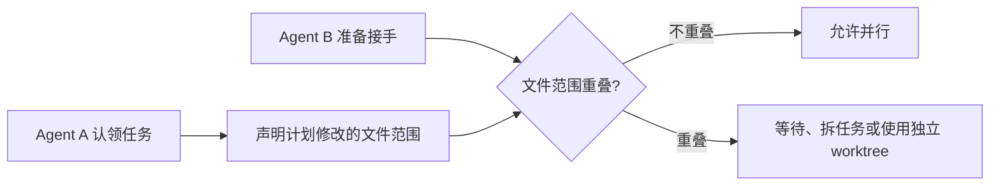

# Agent Relay 简化方案

## 一句话定义

Agent Relay 是一个**只需执行一次的项目安装 Skill**。

安装完成后，能力由项目中的常驻入口、运行脚本和状态文件维持。以后无论由 Codex、Pi、Claude Code、Cursor、Gemini、Copilot、Cline 或其他 Agent 接手，都不需要用户再次主动触发 Skill。

> Skill 负责安装，项目自己负责长期运行。

## 只保留四项能力

| 能力 | 自动行为 | 解决的问题 |
| --- | --- | --- |
| 自动接手 | 新 Agent 先读交接总览，再开始工作 | 不知道上一个 Agent 做到哪里 |
| 自动记录 | 完成任务后记录目标、动作、结果和下一步 | 对话切换后丢失上下文 |
| 自动封版 | 识别明确的定版意图，保存不可变版本 | 后续修改覆盖已交付成果 |
| 自动协调 | 任务认领、文件避让、环境能力对比 | 多 Agent 冲突或工具无法复用 |

目标只用于提醒，不强制当前任务。用户当前消息始终优先。

## 为什么安装一次后能持续生效

Skill 首次执行时，不只是写一份 `SKILL.md`，而是把最小运行能力装进当前项目：


以后启动任何 Agent 时，依靠项目入口自动进入以下流程：



## 项目内最小结构

```text
project/
├── AGENTS.md                       # 跨 Harness 自动入口
├── CLAUDE.md                       # Claude 入口，导入 AGENTS.md
├── GEMINI.md                       # Gemini 入口，导入 AGENTS.md
├── .agents/skills/agent-relay/     # 项目级 Skill 兼容入口
└── .agent-relay/
    ├── HANDOFF.md                  # 每个 Agent 第一时间读取的短总览
    ├── relay.py                    # 项目内常驻运行脚本
    ├── goals.json                  # 长期、短期和候选目标
    ├── tasks/                      # 任务、认领人、文件范围和状态
    ├── events/                     # 每次任务的简短事实记录
    ├── versions/                   # 已封版成果和版本历程
    ├── environments/               # 脱敏后的环境与能力快照
    └── runtime/                    # 锁、租约和本机临时状态
```

`AGENTS.md` 是通用主入口，其他 Harness 文件只引用同一套规则，不分别维护多份真相。

## 日常自动流程



## 定版流程

只有明确表达“现在可以交付”的语义才自动封版，不能只按单个关键词机械判断。



| 用户语义 | 默认处理 |
| --- | --- |
| “定版”“最终版”“就按这个发” | 自动封版 |
| “现在发给领导/同事” | 发送前自动封版 |
| “可以了”“就这样” | 结合上下文，不明确就问范围 |
| “之后还要发”“先继续改” | 不封版 |

封版只保存本次交付物、校验值和版本历程；默认不复制整个大型项目。

## 多 Agent 协作规则



| 情况 | 行为 |
| --- | --- |
| 不同任务、文件不重叠 | 可并行执行 |
| 不同任务、文件重叠 | 阻止第二个写入者 |
| 原 Agent 长时间无心跳 | 租约过期后允许审计式接管 |
| 需要同时改同一模块 | 推荐独立 Git worktree 后合并 |
| 只读取同一文件 | 允许并行 |

## 环境记录也做简化

每次动作只引用一个环境快照 ID，不重复记录整台电脑。只有环境变化时才创建新快照。

记录：

- 操作系统、架构、Harness、模型和版本，探测不到就写 `unknown`。
- 可用工具能力、Skill、MCP、插件名称与脱敏配置路径。
- Git、SSH 命令路径、SSH Host alias、公钥指纹和最近验证时间。

不记录：

- Token、密码、Cookie、私钥内容、Keychain 内容。
- 完整环境变量值、完整聊天记录、模型隐含思维过程。

如果历史流程依赖当前没有的工具，Agent 必须说明：缺少什么、可替代什么、结果有何差异，并在采用实质不同的方案前取得用户同意。

## 边界与可靠性

- 项目指令无法覆盖系统、组织策略或用户当前明确指令。
- 不同 Harness 的历史聊天通常不能互相读取；无法访问时保持空白，不编造。
- “自动执行”来自项目入口文件和可选生命周期 Hook，而不是依赖 Agent 自己想起 Skill。
- 初始化必须幂等、支持预览和卸载，不能覆盖现有 `AGENTS.md` 等文件。
- 共享记录必须脱敏；本机路径、锁和缓存默认加入 `.gitignore`。

## 推荐首版

首版只实现以下命令即可：

```text
relay init       安装项目常驻能力
relay start      读取环境、创建或认领任务
relay finish     记录结果并刷新交接
relay seal       创建不可变版本
relay status     查看任务、冲突和最近动作
relay doctor     验证各 Harness 入口是否有效
```

所有自动行为最终都调用这六个稳定动作。以后即使增加 Hook、MCP 或可视化界面，也不改变底层数据协议。
